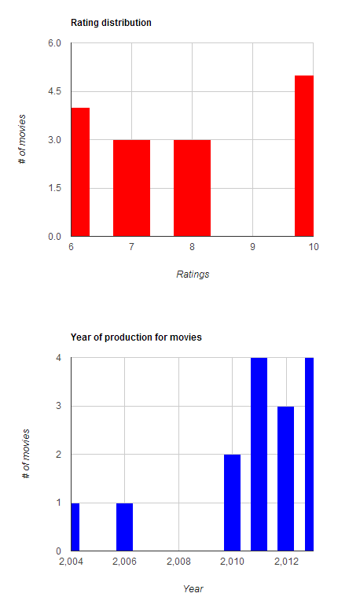
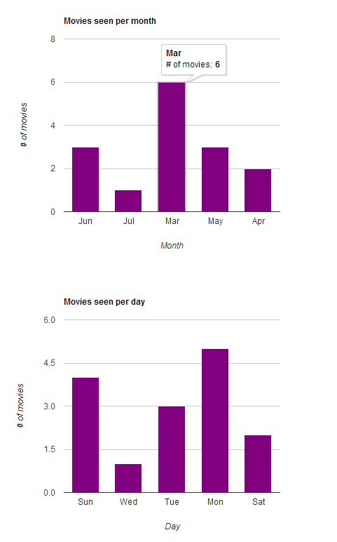

Trakt Charts
============
A simple PHP/JavaScript project that 

 + imports your movies data from RottenTomatoes or from a local CSV file to Trakt 
 + uses [Trakt API](http://trakt.tv) &amp; [Google Charts](https://developers.google.com/chart/) to show charts of your data
 + creates a [JQuery sortable table](http://tablesorter.com/docs/#Demo) with all your seen movies

## Description and architecture
A project to import your movies data into the Trakt community, produce interactive movie charts (e.g. movies rating distribution, movies seen per day/month/year, movies by genre/year of production) and display sortable movies tables (e.g. watched movies). 
Ruby script development to automatically parse RottenTomatoes rankings webpage and generate a CSV file. 
PHP application development and integration with existing API (such as OMDB and Trakt API), interactive graph generation via Google Charts and sortable table creation via JQuery.

## Goals

The goals of this project are the following.

 + parse your RottenTomatoes rankings webpage and get your data via (i.e. movie title/movie year/your rating/movie seen date) a Ruby script 
 + enhance your data with [OMDB API](http://www.omdbapi.com/) to get the IMDB ID needed for import into [Trakt](http://trakt.tv/)
 + generate the JSON array to import all your movies and ratings data into Trakt (you can use the [Trakt APIGEE Console](https://apigee.com/trakt/console)
 + create a PHP webpage displaying charts of your Trakt data, e.g. how many movies you watched per week (see example images below)
 + create a [JQuery sortable table](http://tablesorter.com/docs/#Demo) with your seen movies
 



## Changelog
v 0.1 beta: added https://code.google.com/p/php-class-for-google-chart-tools/ with an example of Google chart

v 0.1 added http://tablesorter.com/docs/ to sort the HTML table


### Usage examples

[TODO]

```Ruby
parseRottenTomatoes.rb > list.csv
```
Use this Ruby script (parseRottenTomatoes.rb) to create a list of ratings from your RottenTomatoes rating webpage, and outputs it into a file called list.csv with the following format.

```CSV
127 Hours (2010);60%;3/19/11
21 Jump Street (2012);80%;8/21/12
50 First Dates (2004);80%;10/09/11
```

NOTE: you need to specify your RottenTomatoes UserID into the parseRottenTomatoes.rb script before running it!

```Ruby
parseRottenTomatoes.rb > list.csv
```

__TODO__
- [x] import from RottenTomatoes
- [x] export to JSON format to be imported into Trakt
- [ ] make it work for shows as well (not only movies)
- [ ] other features?


## Note
Under development!
Feel free to contact me.
